 

<h2></h2>

I build backend systems and integrations and diagnose production incidents. I have over three years of remote experience with APIs, SQL, queues, financial messaging, electronic invoicing and internal tools using Python/Django, NestJS, Laravel and Java.

I like the difficult part of a system: following a record, message or transaction through SQL, logs and code until the failure is clear, then turning the finding into a fix the team can maintain.

| System integrations | Production support | Internal tools |
|---|---|---|
| SWIFT MT and ISO 20022 messaging, electronic invoicing connectors and data workflows between systems. | L2/L3 incidents traced through SQL, logs and code, with a written root cause. | Estimation tools, inventory platforms, reports, queued exports and admin panels. |

> Kubernetes, Terraform and observability are areas I practice in personal projects; I do not present them as employer-operated production infrastructure.

<h2></h2>

<h2></h2>

<table>
<tr>
<td width="50%" valign="top">

### [TomoReader](https://github.com/gabo8191/TomoReader)

Desktop comic and manga reader (**CBR/CBZ**) built with **Rust + Tauri 2** and React. Eye-friendly reading themes, reading-progress tracking and a SQLite-backed library.

`Rust` `Tauri` `React` `TypeScript` `SQLite`

</td>
<td width="50%" valign="top">

### [AutoTranslate-Anki](https://github.com/gabo8191/AutoTranslate-Anki)

**Anki** add-on that fills note translations for a whole deck in one click. Built in **Python**, no API key required, with configurable language pairs and field mapping.

`Python` `Anki` `Add-on`

</td>
</tr>
</table>

<h2></h2>

<table>
<tr>
<td width="50%" valign="top">

### [Cadáver Exquisito](https://cadaver-exquisito-six.vercel.app/)

Serverless multiplayer web app for collective storytelling. A group builds a story in turns with **no backend**: the host's browser runs the authoritative engine over **WebRTC** (PeerJS), and all state persists locally in **IndexedDB**. Nobody sees what others wrote until the final reveal.

`TypeScript` `React` `Vite` `WebRTC` `IndexedDB`

</td>
<td width="50%" valign="top">

### [NeuroSess](https://neurosess.netlify.app/)

Recording and transcription app for neuropsychology sessions, where the audio never leaves the consulting room. A static **Next.js** frontend talks over loopback to a **local Python engine** (FastAPI + **faster-whisper**, shipped as a **PyInstaller** binary for Windows and Linux), the only piece that runs inference and writes to disk.

`TypeScript` `Next.js` `Python` `FastAPI` `faster-whisper` `IndexedDB`

</td>
</tr>
</table>

<h2></h2>

<b>Keyrus Colombia</b> · BI and Data Analytics Intern · <code>Jul. 2026 – Present</code>

 

- Designed and built an internal **Django** application that analyzes files and estimates effort for the team.
- Built its REST API with **DRF**, background processing with Celery and Redis and PostgreSQL persistence, with automated tests in GitHub Actions.
- Prepared and validated data with **SQL and Python** for dashboard analysis.

`Python` `Django` `DRF` `Celery` `Redis` `PostgreSQL` `SQL`

<b>TotalDev SAS</b> · Freelance Full Stack Developer · <code>Feb. 2025 – Mar. 2026</code>

 

- Added SWIFT MT support to an interbank gateway in **Java/Apache Camel**: MT103 and MT202 validation and automated ISO 20022 conversion.
- Developed the core modules of an electoral inventory platform in **Laravel and React**: bulk imports with row-level validation, regional permissions, Excel reports and queued PDF generation.
- Built a QR-scanning **PWA** for the operators of an industrial plant and its Laravel/Filament backend, with approvals, PDF delivery notes and monthly inventory reports.

`Java` `Apache Camel` `SWIFT` `ISO 20022` `Laravel` `Filament` `React` `PWA`

<b>PARQ</b> · Full Stack Developer · <code>Nov. 2024 – Jul. 2025</code>

 

- Extended the **SATCOM, Siigo and Alegra** electronic invoicing connectors in a Laravel middleware with queued resend of failed invoices and per-request tracing.
- Maintained the **NestJS and PostgreSQL** services of a parking platform in Colombia, Mexico and the UK: country-specific rates, queued bulk membership creation and consistent timezones in reports.
- Built the corporate **Next.js** site with SSR, i18n and SEO and documented the APIs with OpenAPI.

`NestJS` `TypeORM` `PostgreSQL` `Laravel` `Next.js` `OpenAPI`

<b>SEREMPRE</b> · Backend Developer · <code>Jan. 2023 – Nov. 2024</code>

 

- Diagnosed **L2/L3 production incidents** by tracing each failure through SQL, code review and Sentry, and documented its root cause.
- Built **Laravel APIs** for a benefits platform in more than five Latin American countries, with queues for validated payment uploads, duplicate cleanup and notifications.
- Wrote queries, **PL/SQL** procedures and Excel exports for other teams, and containerized legacy systems with Docker/DDEV.

`Laravel` `MySQL` `Oracle PL/SQL` `Sentry` `Docker` `Redis`

<h2></h2>

| | |
|---|---|
| **Systems and Computer Engineering** | UPTC, Tunja · Expected 2026 |
| **Information Systems Analysis and Development** (technologist) | SENA · 2022 |
| **Languages** | Spanish (native) · English (B2) |

 

  

Tunja, Colombia · Remote · Spanish and English

